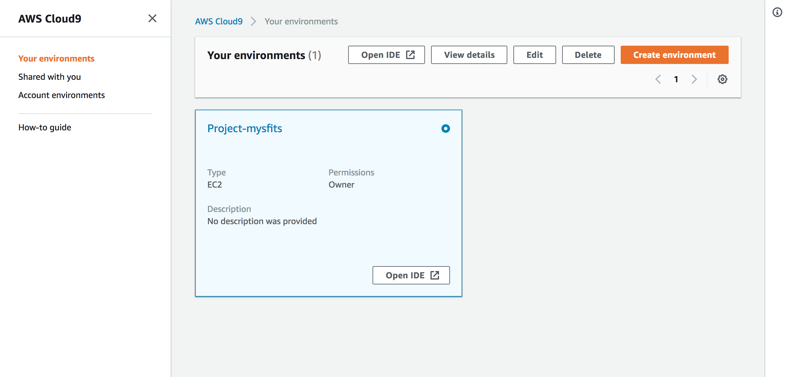
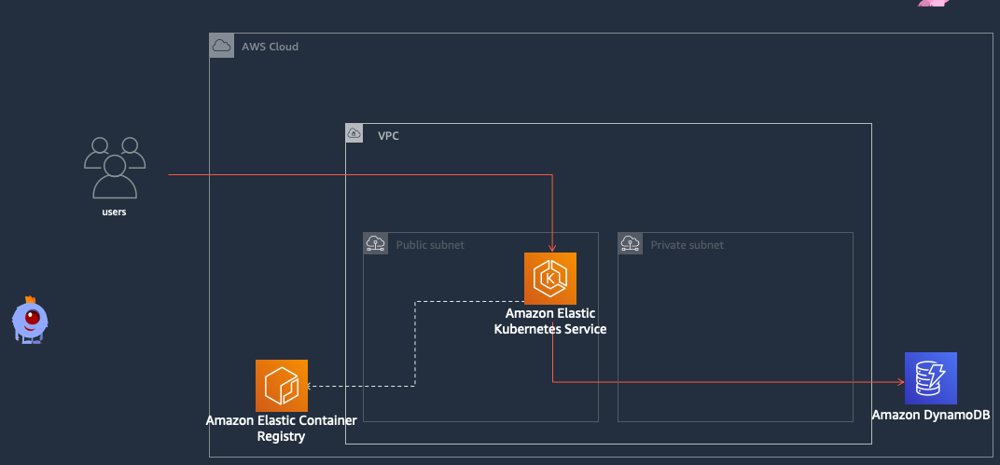
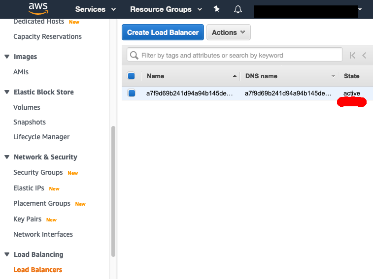

Monolith to Microservices with Docker and AWS EKS
====================================================

Welcome to the Mythical Mysfits team!

In this lab, you'll build the monolithic Mythical Mysfits adoption platform with Docker, deploy it on Amazon ECS, and then break it down into a couple of more manageable microservices. Let's get started!

### Requirements:

* AWS account - if you don't have one, it's easy and free to [create one](https://aws.amazon.com/).
* AWS IAM account with elevated privileges allowing you to interact with CloudFormation, IAM, EC2, ECS, ECR, ELB/ALB, VPC, SNS, CloudWatch, Cloud9. [Learn how](https://docs.aws.amazon.com/IAM/latest/UserGuide/id_users_create.html).
* Familiarity with [Python](https://wiki.python.org/moin/BeginnersGuide/Programmers), [Docker](https://www.docker.com/), and [AWS](httpts://aws.amazon.com) - *not required but a bonus*.

### What you'll do:

These labs are designed to be completed in sequence, and the full set of instructions are documented below.  Read and follow along to complete the labs.  If you're at a live AWS event, the workshop staff will give you a high-level overview of the labs and help answer any questions.  Don't worry if you get stuck, we provide hints along the way.

* **Workshop Setup:** [Setup working environment on AWS](#lets-begin)
* **Lab 1:** [Containerize the Mythical Mysfits monolith](#lab-1---containerize-the-mythical-mysfits-adoption-agency-platform)
* **Lab 2:** [Deploy your container using ECR/EKS](#lab-2---deploy-your-container-using-ecreks)
* **Lab 3:** [Scale the adoption platform monolith with an NLB](#lab-3---scale-the-adoption-platform-monolith-with-an-nlb)
* **Lab 4:** [Incrementally build and deploy each microservice using EKS](#lab-4-incrementally-build-and-deploy-each-microservice-using-eks)

### Conventions:

Throughout this workshop, we will provide commands for you to run in the terminal.  These commands will look like this:

<pre>
$ ssh -i <b><i>PRIVATE_KEY.PEM</i></b> ec2-user@<b><i>EC2_PUBLIC_DNS_NAME</i></b>
</pre>

The command starts after the `$`.  Text that is ***UPPER_ITALIC_BOLD*** indicates a value that is unique to your environment.  For example, ***PRIVATE\_KEY.PEM*** refers to the private key of an SSH key pair that you've created in your account, and ***EC2\_PUBLIC\_DNS\_NAME*** is a value that is specific to an EC2 instance launched in your account.  You can find these unique values either in the CloudFormation outputs or by navigating to the specific service dashboard in the [AWS management console](https://console.aws.amazon.com).

Hints are also provided along the way and will look like this:

<details>
<summary>HINT</summary>

**Nice work, you just revealed a hint!**
</details>


*Click on the arrow to show the contents of the hint.*

### IMPORTANT: Region selection

We are assuming this workshop is run in the ap-southeat-1 (Singapore) region. Care has been taken to specify this along the way, but if in doubt always select this region.

### IMPORTANT: Workshop Cleanup

You will be deploying infrastructure on AWS which will have an associated cost. If you're attending an AWS event, credits will be provided.  When you're done with the workshop, [follow the steps at the very end of the instructions](#workshop-cleanup) to make sure everything is cleaned up and avoid unnecessary charges.


## Let's Begin!

### Workshop Setup:

1. Setup your Cloud9 developer environment by launching the below stack. This will create a Cloud9 linux environment for you which you will use to complete the rest of the lab.

  Click on the **Deploy to AWS** icons below to stand up the core workshop infrastructure.

| Region | Launch Template |
| ------------ | ------------- | 
**Singapore** (ap-southeast-1) | [](https://console.aws.amazon.com/cloudformation/home?region=ap-southeast-1#/stacks/new?stackName=mysfits-cloud9&templateURL=https://mythical-mysfits-bootstrap.s3.amazonaws.com/cloud9.yml)


2. The template will automatically bring you to the CloudFormation Dashboard and start the stack creation process in the specified region. <b><i>Leaving the stack name as is</b></i>, or some of the automation later on will break. proceed through the wizard to launch the stack. Leave all options at their default values, but make sure to check the box to allow CloudFormation to create IAM roles on your behalf:

    

    See the *Events* tab for progress on the stack launch. You can also see details of any problems here if the launch fails. Proceed to the next step once the stack status advances to "CREATE_COMPLETE".


3. Access the AWS Cloud9 Environment created by CloudFormation:

    On the AWS Console home page, type **Cloud9** into the service search bar and select it. Find the environment named like "Project-***STACK_NAME***":

    

    When you open the IDE, you'll be presented with a welcome screen that looks like this:
    

    On the left pane (Blue), any files downloaded to your environment will appear here in the file tree. In the middle (Red) pane, any documents you open will show up here. Test this out by double clicking on README.md in the left pane and edit the file by adding some arbitrary text. Then save it by clicking File and Save. Keyboard shortcuts will work as well. On the bottom, you will see a bash shell (Yellow). For the remainder of the lab, use this shell to enter all commands. You can also customize your Cloud9 environment by changing themes, moving panes around, etc. (if you like the dark theme, you can select it by clicking the gear icon in the upper right, then "Themes", and choosing the dark theme).

4. Clone the Mythical Mysfits Workshop Repository:

    In the bottom panel of your new Cloud9 IDE, you will see a terminal command line terminal open and ready to use.  Run the following git command in the terminal to clone the necessary code to complete this tutorial:

    ```
    $ git clone https://github.com/Ancient87/mythical-mysfits-eks.git
    ```

    After cloning the repository, you'll see that your project explorer now includes the files cloned.

    In the terminal, change directory to the subdirectory for this workshop in the repo:

    ```
    $ cd mythical-mysfits-eks/workshop-1-k8s
    ```

5.  Setup the credentials in Cloud9. Run the below script to associate the instance role 

    ```
    $ script/associate-profile.sh
    ```
    
    Now you need to disable the Cloud9 temporary credentials. Click AWS Cloud9 -> preferences -> AWS Settings. Find aws managed credentials and turn it off. You can see what this looks like below.
    
    
    
    
    
    Verify that it worked. by running the below. You should see something along the lines of "Arn": arn:aws:sts::ACCOUNT_ID:assumed-role/<i>mysfits-cloud9-C9Role</i>-1F2WMFHBSLUSY/i-0d83a4808c97ef448". If you don't see mysfits-cloud9-C9Role ask for help and do not continue until this step can be completed succesfully.
    
    ```
    aws sts get-caller identity
    ```

6. Resize the volume. The default Cloud9 instance comes with 10GB of space. As we are going to be downloading a lot of container images this won't be sufficient. Rune the following command to resize to 20GB

    ```
    $ script/resize.sh 20
    ```

7. Prepre the IAC provider

     
    ```
    $ cd cdk
    ```
    
    Install the dependency manager and dependencies
    
    ```
    $ sudo pip install poetry
    ```
    
    ```
    $ poetry install
    ```
    
    Bootstrap your environment
    
    ```
    $ poetry run cdk bootstrap
    ```

7. A kick-off deployment of the website <b>Step 7 and 8 are to be done in In parallel</b> This takes about 20 minutes, and we won't need this until Lab 3, so kick it off now in a new terminal and continue the lab. 
    
    ```
    $ poetry run cdk deploy mythicaldistributionstack --require-approval never
    ```

8.  Deploy the cloud development kit (cdk) stack to setup your workshop environment. This step will take about 15 minutes, so it's suggested you do it as soon as possible and perhaps let it running over a break.

    Deploy your EKS environment. Note: This will take ~15 minutes at (65/77) status which is normal and expected. This is the step that sets up your Kubernetes cluster so when you get here it might be a good time to go and take a break. <b>Once step 8 is complete you can move on </b>
    
    ```
    $ poetry run cdk deploy mythicalstack --require-approval never
    ```
    

9. Run some additional automated setup steps with the `setup` script:

    ```
    $ cd ..
    $ export AWS_DEFAULT_REGION=ap-southeast-1
    $ script/install_kubectl.sh
    $ script/setup
    $ source .environ
    ```

    This script will delete some unneeded Docker images to free up disk space, populate a DynamoDB table with some seed data, upload site assets to S3, and install some Docker-related authentication mechanisms that will be discussed later. Make sure you see the "Success!" message when the script completes.
    
    The ```source .environ``` command sets environment vairables for the scripts. Every time you resume the workshop from a longer break you may need to rerun this to provide the right details to commands.
    
    Next, please run following command to generate SSH Key in Cloud9. This key will be used later in stateful microservices with EFS lab.
    ```
    ssh-keygen
    ```
    Press enter 3 times to take the default choices.
    Upload the public key to your EC2 region:
    ```
    aws ec2 import-key-pair --key-name "eksworkshop" --public-key-material file://~/.ssh/id_rsa.pub
    ```


10. Login to your container repository

    ```
    aws ecr get-login-password --region ap-southeast-1 | docker login --username AWS --password-stdin $ECR_MONOLITH
    ```
    
    You should see 
    
    ```
    Login Succeeded
    ```

### Checkpoint:
At this point, the Mythical Mysfits website should be available at the static site endpoint for the Cloudfront distribution. <code>https://$MYTHICAL_WEBSITE</code> where the full name can be found in the `workshop-1/cfn-output.json` filee. Check that you can view the site, but there won't be much content visible yet until we launch the Mythical Mysfits monolith service:


[*^ back to top*](#monolith-to-microservices-with-docker-and-aws-fargate)


## Lab 1 - Containerize the Mythical Mysfits adoption agency platform


The Mythical Mysfits adoption agency infrastructure has always been running directly on EC2 VMs. Our first step will be to modernize how our code is packaged by containerizing the current Mythical Mysfits adoption platform, which we'll also refer to as the monolith application.  To do this, you will create a [Dockerfile](https://docs.docker.com/engine/reference/builder/), which is essentially a recipe for [Docker](https://aws.amazon.com/docker) to build a container image.  You'll use your [AWS Cloud9](https://aws.amazon.com/cloud9/) development environment to author the Dockerfile, build the container image, and run it to confirm it's able to process adoptions.

[Containers](https://aws.amazon.com/what-are-containers/) are a way to package software (e.g. web server, proxy, batch process worker) so that you can run your code and all of its dependencies in a resource isolated process. You might be thinking, "Wait, isn't that a virtual machine (VM)?" Containers virtualize the operating system, while VMs virtualize the hardware. Containers provide isolation, portability and repeatability, so your developers can easily spin up an environment and start building without the heavy lifting.  More importantly, containers ensure your code runs in the same way anywhere, so if it works on your laptop, it will also work in production.

### Here's what you're going to work on in lab 1:


1. Review the draft Dockerfile and add the missing instructions indicated by comments in the file:

    *Note: If you're already familiar with how Dockerfiles work and want to focus on breaking the monolith apart into microservices, skip down to ["HINT: Final Dockerfile"](#final-dockerfile) near the end of step 5, create a Dockerfile in the monolith directory with the hint contents, build the "monolith" image, and continue to step 6.  Otherwise continue on...*

    One of the Mythical Mysfits' developers started working on a Dockerfile in her free time, but she was pulled to a high priority project before she finished.

    In the Cloud9 file tree, navigate to `workshop-1/app/monolith-service`, and double-click on **Dockerfile.draft** to open the file for editing.

    *Note: If you would prefer to use the bash shell and a text editor like vi or emacs instead, you're welcome to do so.*

    Review the contents, and you'll see a few comments at the end of the file noting what still needs to be done.  Comments are denoted by a "#".

    Docker builds container images by stepping through the instructions listed in the Dockerfile.  Docker is built on this idea of layers starting with a base and executing each instruction that introduces change as a new layer.  It caches each layer, so as you develop and rebuild the image, Docker will reuse layers (often referred to as intermediate layers) from cache if no modifications were made.  Once it reaches the layer where edits are introduced, it will build a new intermediate layer and associate it with this particular build.  This makes tasks like image rebuild very efficient, and you can easily maintain multiple build versions.

    

    For example, in the draft file, the first line - `FROM ubuntu:latest` - specifies a base image as a starting point.  The next instruction - `RUN apt-get -y update` - creates a new layer where Docker updates package lists from the Ubuntu repositories.  This continues until you reach the last instruction which in most cases is an `ENTRYPOINT` *(hint hint)* or executable being run.

    Add the remaining instructions to Dockerfile.draft.

    <details>
    <summary>HINT: Helpful links for completing Dockefile.draft</summary>
    <pre>
    Here are links to external documentation to give you some ideas:

    #[TODO]: Copy the "service" directory into container image

    - Consider the [COPY](https://docs.docker.com/engine/reference/builder/#copy) command
    - You're copying both the python source files and requirements.txt from the "monolith-service/service" directory on your EC2 instance into the working directory of the container, which can be specified as "."

    #[TODO]: Install dependencies listed in the requirements.txt file using pip

    - Consider the [RUN](https://docs.docker.com/engine/reference/builder/#run) command
    - More on [pip and requirements files](https://pip.pypa.io/en/stable/user_guide/#requirements-files)

    #[TODO]: Specify a listening port for the container

    - Consider the [EXPOSE](https://docs.docker.com/engine/reference/builder/#expose) command
    - App listening portNum can be found in the app source - mythicalMysfitsService.py

    #[TODO]: Run "mythicalMysfitsService.py" as the final step. We want this container to run as an executable. Looking at ENTRYPOINT for this?

    - Consider the [ENTRYPOINT](https://docs.docker.com/engine/reference/builder/#entrypoint) command
    - Our ops team typically runs 'python mythicalMysfitsService.py' to launch the application on our servers.
    </pre>
    </details>

    Once you're happy with your additions OR if you get stuck, you can check your work by comparing your work with the hint below.

    <details>
    <summary>HINT: Completed Dockerfile</summary>
    <pre>
    FROM ubuntu:latest
    RUN apt-get update -y
    RUN apt-get install -y python-pip python-dev build-essential
    RUN pip install --upgrade pip
    COPY ./service /MythicalMysfitsService
    WORKDIR /MythicalMysfitsService
    RUN pip install -r ./requirements.txt
    EXPOSE 80
    ENTRYPOINT ["python"]
    CMD ["mythicalMysfitsService.py"]
    </pre>
    </details>

    If your Dockerfile looks good, rename your file from "Dockerfile.draft" to "Dockerfile" and continue to the next step.

    <pre>
    $ mv Dockerfile.draft Dockerfile
    </pre>

2. Build the image using the [Docker build](https://docs.docker.com/engine/reference/commandline/build/) command.

    This command needs to be run in the same directory where your Dockerfile is. **Note the trailing period** which tells the build command to look in the current directory for the Dockerfile.

    Note: Make sure you're in the right directory when you do this
    <pre>
    $ cd app/monolith-service/ && docker build -t monolith-service -f Dockerfile.solved . && cd -
    </pre>

    You'll see a bunch of output as Docker builds all layers of the image.  If there is a problem along the way, the build process will fail and stop (red text and warnings along the way are fine as long as the build process does not fail).  Otherwise, you'll see a success message at the end of the build output like this:

    <pre>
    Step 9/10 : ENTRYPOINT ["python"]
     ---> Running in 7abf5edefb36
    Removing intermediate container 7abf5edefb36
     ---> 653ccee71620
    Step 10/10 : CMD ["mythicalMysfitsService.py"]
     ---> Running in 291edf3d5a6f
    Removing intermediate container 291edf3d5a6f
     ---> a8d2aabc6a7b
    Successfully built a8d2aabc6a7b
    Successfully tagged monolith-service:latest
    </pre>

    *Note: Your output will not be exactly like this, but it will be similar.*

    Awesome, your Dockerfile built successfully, but our developer didn't optimize the Dockefile for the microservices effort later.  Since you'll be breaking apart the monolith codebase into microservices, you will be editing the source code (e.g. `mythicalMysfitsService.py`) often and rebuilding this image a few times.  Looking at your existing Dockerfile, what is one thing you can do to improve build times?

    <details>
    <summary>HINT</summary>
    Remember that Docker tries to be efficient by caching layers that have not changed.  Once change is introduced, Docker will rebuild that layer and all layers after it.

    Edit mythicalMysfitsService.py by adding an arbitrary comment somewhere in the file.  If you're not familiar with Python, [comments](https://docs.python.org/2/tutorial/introduction.html) start with the hash character, '#' and are essentially ignored when the code is interpreted.

    For example, here a comment (`# Author: Mr Bean`) was added before importing the time module:
    <pre>
    # Author: Mr Bean

    import time
    from flask import Flask
    from flask import request
    import json
    import requests
    ....
    </pre>

    Rebuild the image using the 'docker build' command from above and notice Docker references layers from cache, and starts rebuilding layers starting from Step 5, when mythicalMysfitsService.py is copied over since that is where change is first introduced:

    <pre>
    Step 5/10 : COPY ./service /MythicalMysfitsService
     ---> 9ec17281c6f9
    Step 6/10 : WORKDIR /MythicalMysfitsService
     ---> Running in 585701ed4a39
    Removing intermediate container 585701ed4a39
     ---> f24fe4e69d88
    Step 7/10 : RUN pip install -r ./requirements.txt
     ---> Running in 1c878073d631
    Collecting Flask==0.12.2 (from -r ./requirements.txt (line 1))
    </pre>

    Try reordering the instructions in your Dockerfile to copy the monolith code over after the requirements are installed.  The thinking here is that the Python source will see more changes than the dependencies noted in requirements.txt, so why rebuild requirements every time when we can just have it be another cached layer.
    </details>

    Edit your Dockerfile with what you think will improve build times and compare it with the Final Dockerfile hint below.


    #### Final Dockerfile (as found in Dockerfile.solved)
    <details>
    <summary>HINT: Final Dockerfile</summary>
    <pre>
    FROM ubuntu:latest
    RUN apt-get update -y
    RUN apt-get install -y python3-pip python-dev build-essential
    RUN pip3 install --upgrade pip
    COPY service/requirements.txt .
    RUN pip3 install --no-cache-dir -r ./requirements.txt
    COPY ./service /MythicalMysfitsService
    WORKDIR /MythicalMysfitsService
    EXPOSE 80
    ENTRYPOINT ["python3"]
    CMD ["mythicalMysfitsService.py"]
    </pre>
    </details>

    To see the benefit of your optimizations, you'll need to first rebuild the monolith image using your new Dockerfile (use the same build command at the beginning of step 5).  Then, introduce a change in `mythicalMysfitsService.py` (e.g. add another arbitrary comment) and rebuild the monolith image again.  Docker cached the requirements during the first rebuild after the re-ordering and references cache during this second rebuild.  You should see something similar to below:

    <pre>
    Step 6/11 : RUN pip3 install -r ./requirements.txt
     ---> Using cache
     ---> 612509a7a675
    Step 7/11 : COPY ./service /MythicalMysfitsService
     ---> c44c0cf7e04f
    Step 8/11 : WORKDIR /MythicalMysfitsService
     ---> Running in 8f634cb16820
    Removing intermediate container 8f634cb16820
     ---> 31541db77ed1
    Step 9/11 : EXPOSE 80
     ---> Running in 02a15348cd83
    Removing intermediate container 02a15348cd83
     ---> 6fd52da27f84
    </pre>

    You now have a Docker image built.  The -t flag names the resulting container image.  List your docker images and you'll see the "monolith-service" image in the list. Here's a sample output, note the monolith image in the list:

    <pre>
    $ docker images
    REPOSITORY                                                              TAG                 IMAGE ID            CREATED              SIZE
    monolith-service                                                        latest              29f339b7d63f        About a minute ago   506MB
    ubuntu                                                                  latest              ea4c82dcd15a        4 weeks ago          85.8MB
    golang                                                                  1.9                 ef89ef5c42a9        4 months ago         750MB
    </pre>

    *Note: Your output will not be exactly like this, but it will be similar.*

    Notice the image is also tagged as "latest".  This is the default behavior if you do not specify a tag of your own, but you can use this as a freeform way to identify an image, e.g. monolith-service:1.2 or monolith-service:experimental.  This is very convenient for identifying your images and correlating an image with a branch/version of code as well.

3. Run the docker container and test the adoption agency platform running as a container:

    Use the [docker run](https://docs.docker.com/engine/reference/run/) command to run your image; the -p flag is used to map the host listening port to the container listening port.

    <pre>
    $ docker run -p 8000:80 -e DDB_TABLE_NAME=$DDB_TABLE_NAME -e AWS_DEFAULT_REGION=ap-southeast-1 -e AWS_ACCESS_KEY_ID=$AWS_ACCESS_KEY_ID -e AWS_SECRET_ACCESS_KEY=$AWS_SECRET_ACCESS_KEY -e AWS_SESSION_TOKEN=$AWS_SESSION_TOKEN monolith-service
    </pre>

    *Note: You can find your DynamoDB table name in the file `workshop-1/cfn-output.json` derived from the outputs of the CloudFormation stack.*

    Here's sample output as the application starts:

    ```
    * Running on http://0.0.0.0:80/ (Press CTRL+C to quit)
    ```

    *Note: Your output will not be exactly like this, but it will be similar.*

    To test the basic functionality of the monolith service, query the service using a utility like [cURL](https://curl.haxx.se/), which is bundled with Cloud9.

    Click on the plus sign next to your tabs and choose **New Terminal** or click **Window** -> **New Terminal** from the Cloud9 menu to open a new shell session to run the following curl command.

    <pre>
    $ curl http://localhost:8000/mysfits
    </pre>

    You should see a JSON array with data about a number of Mythical Mysfits.

    *Note: Processes running inside of the Docker container are able to authenticate with DynamoDB because they can access the EC2 metadata API endpoint running at `169.254.169.254` to retrieve credentials for the instance profile that was attached to our Cloud9 environment in the initial setup script. Processes in containers cannot access the `~/.aws/credentials` file in the host filesystem (unless it is explicitly mounted into the container).*

    Switch back to the original shell tab where you're running the monolith container to check the output from the monolith.

    The monolith container runs in the foreground with stdout/stderr printing to the screen, so when the request is received, you should see a `200`. "OK".

    Here is sample output:

    <pre>
    INFO:werkzeug:172.17.0.1 - - [16/Nov/2018 22:24:18] "GET /mysfits HTTP/1.1" 200 -
    </pre>

    In the tab you have the running container, type **Ctrl-C** to stop the running container.  Notice, the container ran in the foreground with stdout/stderr printing to the console.  In a production environment, you would run your containers in the background and configure some logging destination.  We'll worry about logging later, but you can try running the container in the background using the -d flag.

    <pre>
    $ docker run -d -p 8000:80 -e DDB_TABLE_NAME=$DDB_TABLE_NAME -e AWS_DEFAULT_REGION=ap-southeast-1 -e AWS_ACCESS_KEY_ID=$AWS_ACCESS_KEY_ID -e AWS_SECRET_ACCESS_KEY=$AWS_SECRET_ACCESS_KEY -e AWS_SESSION_TOKEN=$AWS_SESSION_TOKEN monolith-service
    </pre>

    List running docker containers with the [docker ps](https://docs.docker.com/engine/reference/commandline/ps/) command to make sure the monolith is running.

    <pre>
    $ docker ps
    </pre>

    You should see monolith running in the list. Now repeat the same curl command as before, ensuring you see the same list of Mysfits. You can check the logs again by running [docker logs](https://docs.docker.com/engine/reference/commandline/ps/) (it takes a container name or id fragment as an argument).

    <pre>
    $ docker logs <b><i>CONTAINER_ID</i></b>
    </pre>

    Here's sample output from the above commands:

    <pre>
    $ docker run -d -p 8000:80 -e AWS_DEFAULT_REGION=<b><i>REGION</i></b> -e DDB_TABLE_NAME=<b><i>TABLE_NAME</i></b> monolith-service
    51aba5103ab9df25c08c18e9cecf540592dcc67d3393ad192ebeda6e872f8e7a
    $ docker ps
    CONTAINER ID        IMAGE                           COMMAND                  CREATED             STATUS              PORTS                  NAMES
    51aba5103ab9        monolith-service:latest         "python mythicalMysf…"   24 seconds ago      Up 23 seconds       0.0.0.0:8000->80/tcp   awesome_varahamihira
    $ curl localhost:8000/mysfits
    {"mysfits": [...]}
    $ docker logs 51a
     * Running on http://0.0.0.0:80/ (Press CTRL+C to quit)
    172.17.0.1 - - [16/Nov/2018 22:56:03] "GET /mysfits HTTP/1.1" 200 -
    INFO:werkzeug:172.17.0.1 - - [16/Nov/2018 22:56:03] "GET /mysfits HTTP/1.1" 200 -
    </pre>

    In the sample output above, the container was assigned the name "awesome_varahamihira".  Names are arbitrarily assigned.  You can also pass the docker run command a name option if you want to specify the running name.  You can read more about it in the [Docker run reference](https://docs.docker.com/engine/reference/run/).  Kill the container using `docker kill` now that we know it's working properly.

4. Now that you have a working Docker image, tag and push the image to [Elastic Container Registry (ECR)](https://aws.amazon.com/ecr/).  ECR is a fully-managed Docker container registry that makes it easy to store, manage, and deploy Docker container images. In the next lab, we'll use ECS to pull your image from ECR.

    In the AWS Management Console, navigate to [Repositories](https://console.aws.amazon.com/ecs/home#/repositories) in the ECS dashboard.  You should see repositories for the monolith service and like service.  These were created by CloudFormation and named like <code><b><i>STACK_NAME</i></b>-mono-xxx</code> and <code><b><i>STACK_NAME</i></b>-like-xxx</code> where ***STACK_NAME*** is the name of the CloudFormation stack (the stack name may be truncated).

    

    Click on the repository name for the monolith, and note down the Repository URI (you will use this value again in the next lab):

    

    *Note: Your repository URI will be unique.*

    Login to ECR, tag and push your container image to the monolith repository.

    ```
    $ aws ecr get-login-password --region ap-southeast-1 | docker login --username AWS --password-stdin $ECR_MONOLITH
    $ docker tag monolith-service:latest $ECR_MONOLITH:latest
    $ docker push $ECR_MONOLITH:latest
    ```

    When you issue the push command, Docker pushes the layers up to ECR.

    Here's sample output from these commands:
    
    <pre>
    $ docker tag monolith-service:latest 873896820536.dkr.ecr.us-east-2.amazonaws.com/mysfit-mono-oa55rnsdnaud:latest
    $ docker push 873896820536.dkr.ecr.us-east-2.amazonaws.com/mysfit-mono-oa55rnsdnaud:latest
    The push refers to a repository [873896820536.dkr.ecr.us-east-2.amazonaws.com/mysfit-mono-oa55rnsdnaud:latest]
    0f03d692d842: Pushed
    ddca409d6822: Pushed
    d779004749f3: Pushed
    4008f6d92478: Pushed
    e0c4f058a955: Pushed
    7e33b38be0e9: Pushed
    b9c7536f9dd8: Pushed
    43a02097083b: Pushed
    59e73cf39f38: Pushed
    31df331e1f23: Pushed
    630730f8c75d: Pushed
    827cd1db9e95: Pushed
    e6e107f1da2f: Pushed
    c41b9462ea4b: Pushed
    latest: digest: sha256:a27cb7c6ad7a62fccc3d56dfe037581d314bd8bd0d73a9a8106d979ac54b76ca size: 3252
    </pre>

    *Note: Typically, you'd have to log into your ECR repo. However, you did not need to authenticate docker with ECR because the [Amazon ECR Credential Helper](https://github.com/awslabs/amazon-ecr-credential-helper) has been installed and configured for you on the Cloud9 Environment.  This was done earlier when you ran the setup script. You can read more about the credentials helper in this [article](https://aws.amazon.com/blogs/compute/authenticating-amazon-ecr-repositories-for-docker-cli-with-credential-helper/).*

    If you refresh the ECR repository page in the console, you'll see a new image uploaded and tagged as latest.

    

### Checkpoint:
At this point, you should have a working container for the monolith codebase stored in an ECR repository and ready to deploy with Kubernetes in the next lab.

[*^ back to the top*](#monolith-to-microservices-with-docker-and-aws-fargate)

## Lab 2 - Deploy your container using ECR/EKS

Deploying individual containers is not difficult.  However, when you need to coordinate many container deployments, a container management tool like Kubernetes can greatly simplify this.

Kubernetes refers to a YAML formatted template called a [Manifest](https://kubernetes.io/docs/reference/glossary/?all=true#term-manifest) that describes one or more resources making up your application and service. The manifest is the recipe that Kubernetes uses to run your containers as a **pod** on your Kubernetes worker nodes.

<details>
<summary>INFO: What is a pod?</summary>
A Pod (as in a pod of whales or pea pod) is a group of one or more containers (such as Docker containers), with shared storage/network, and a specification for how to run the containers. A Pod's contents are always co-located and co-scheduled, and run in a shared context. A Pod models an application-specific "logical host" - it contains one or more application containers which are relatively tightly coupled — in a pre-container world, being executed on the same physical or virtual machine would mean being executed on the same logical host.

[Pods](https://kubernetes.io/docs/concepts/workloads/pods/pod/)


</details>

<details>
<summary>INFO: What is a deployment?</summary>
A Deployment provides declarative updates for Pods and ReplicaSets.

You describe a desired state in a Deployment, and the Deployment Controller changes the actual state to the desired state at a controlled rate. You can define Deployments to create new ReplicaSets, or to remove existing Deployments and adopt all their resources with new Deployments.

[Deployments](https://kubernetes.io/docs/concepts/workloads/controllers/deployment/)

</details>

Containter definition parameters map to options and arguments passed to the [docker run](https://docs.docker.com/engine/reference/run/) command which means you can describe configurations like which container image(s) you want to use, host:container port mappings, cpu and memory allocations, logging, and more.

In this lab, you will create a pod and deployment definition to serve as a foundation for deploying the containerized adoption platform stored in ECR with Kubernetes. You will be using a managed worker node group in this setup.

EKS launches pods with a networking mode called [vpc-cni](https://docs.aws.amazon.com/eks/latest/userguide/pod-networking.html), which gives pods the same networking properties of EC2 instances.  Tasks will essentially receive their own [elastic network interface](https://docs.aws.amazon.com/AWSEC2/latest/UserGuide/using-eni.html).  This offers benefits like task-specific security groups.  Let's get started!



### Instructions:

1. Before we get started we will introduce a few helpful troubleshooting commands for Kubernetes. You may find these helpful whilst trying to go through the rest of this lab. Everything after the "#" can be ignored

    ```
    kubectl get endpoints mysfits-service $MM  # See which pods have been selected for a given service. An empty list indicates an issue
    
    kubectl logs -l app=mysfits  $MM --follow # See the combined logs from all pods matching the selector. Useful to see what is happening within the application deployed to Kubernetes
    
    kubectl describe service/mysfits-service $MM  # 
    
    ```

2. Now we can deploy to Kubernetes. The first task is to update the provided manifest to point at your newly created container image

    Locate the monolith.yml file in the app/manifests directory. Take a moment to familiarise yourself with the format and see if you can recognise the sections we discussed above. When you're ready find and locate the  <code><b><i>CONTAINER IMAGE DEFINITION</i></b> definition and update the image attribute to point at the image you pushed earlier.
    
    <details>
    <summary>HINT: Container image definition</summary>
    
    Each pod spec 
    <pre>
    $ curl http://<b><i>NODE_PUBLIC_IP_ADDRESS:PORT</i></b>/mysfits
    </pre>
    
    </details>
    

3. Before we can use the Kubernetes cluster we need to setup the kubectl cli     to login to it. To do so locate the output in your Cloudformation stack      titled mythicalstack.mythicaleksclusterConfigCommand[SOMENUMBERS] and        paste it into your shell appending "--alias mythicalcluster".

    It may looks comething like this
    <pre>
    mythicalstack.mythicaleksclusterConfigCommand8881EF53 = aws eks update-kubeconfig --name mythical_eks_cluster --region ap-southeast-1 --role-arn arn:aws:iam::547168898833:role/mythicalstack-adminroleDBD57144-JF0TWARTXDPF --alias mythicalcluster
    </pre>
    
    Once done, test that it worked 
    
    ```
    $ kubectl get nodes $MM
    ```
    
    Your output will look something like the following
    
    <pre>
    NAME                                            STATUS   ROLES    AGE     VERSION
    ip-10-0-48-4.ap-southeast-1.compute.internal    Ready    <none>   6h19m       v1.16.8-eks-fd1ea7
    ip-10-0-66-62.ap-southeast-1.compute.internal   Ready    <none>   6h19m       v1.16.8-eks-fd1ea7
    ip-10-0-95-74.ap-southeast-1.compute.internal   Ready    <none>   6h19m       v1.16.8-eks-fd1ea7
    </pre>

4. Once this is set we can deploy to Kubernetes
    
    The following command apply the manifest definition to Kuberntes.
    The result will be, for now, 1 pod running your container image.

    ```
    kubectl apply -f app/manifests/monolith.yml $MM
    kubectl get pods --namespace mysfits --watch $MM
    ```
    
    The second command will let you live observe the status of the pods rolling out.

5. The deployment has produced a pod as expected. Now lets try and connect to it. To do so we need to expose the pod.

    First we need to determine the IP of your task. When using the "Fargate" launch type, each task gets its own ENI and Public/Private IP address. Click on the ID of the task you just launched to go to the detail page for the task. Note down the Public IP address to use with your curl command.

    Note down the EXTERNAL-IP addresses displayed you will need them in the next step. Now we will try and access the service live in the cloud 
    
    <pre>
    $ kubectl get nodes -o wide $MM |  awk {'print $1" " $2 " " $7'} | column -t
    </pre>
    
    Next we need to know the port that Kubernetes is exposing the service at. The following command will list out the port mapping. You will see something like 8080:[0-9]{5}.
    
    <pre>
    $ kubectl get service/mysfits-service $MM
    </pre>
    
    Using a NodePort service type the Kubernetes cluster exposes this service on ALL worker nodes on this port. This means we should be able to access this service on any worker node IP on that port
    
    <details>
    <summary>INFO: What is a NodePort?</summary>
    
    If you set the type field to NodePort, the Kubernetes control plane allocates a port from a range specified by --service-node-port-range flag (default: 30000-32767). Each node proxies that port (the same port number on every Node) into your Service. Your Service reports the allocated port in its .spec.ports[*].nodePort field.

    [NodePort](https://kubernetes.io/docs/concepts/services-networking/service/#nodeport)
    </details>

    <details>
    <summary>HINT: curl refresher</summary>
    
    <pre>
    $ curl http://<b><i>NODE_PUBLIC_IP_ADDRESS:PORT</i></b>/mysfits
    </pre>
    
    </details>

    Uh oh. That didn't work! Why is that? The reason is that we need to manually update the worker node's security group to allow access from the Internet to this port. That doesn't seem ideal and it isn't but don't worry we will address this challenge shortly. For now, go to the EC2 console and update the security group to permit access from your current IP on the high port the service is listening on.
    
    Navigate to Security Groups in the EC2 console and locate a group with the name <i>eks-cluster-sg-mythical_eks_cluster-XXXXXXXXXXX</i>. Edit the group and add an entry for an inbound rule from your public IP to the high port.
    
    
    
    Now let's try again.

    If the curl command was successful, we are now ready to scale the service

## Lab 3 - Scale the adoption platform monolith with an NLB


The method you used in the last lab is good for testing, but we need to run the adoption platform as a long running process.

In this lab, you will use an Elastic Load Balancing [Appliction Load Balancer (ALB)](https://aws.amazon.com/elasticloadbalancing/) to distribute incoming requests to your running containers. In addition to simple load balancing, this provieds capabilities like path-based routing to different services.

What ties this all together is a **Kubernetes Service**, which maps pods belonging together and integrates with the ALB (i.e. handles registration/deregistration of containers to the ALB). We already used a service for the last lab and NodePort is a type of service you can use. In this lab, you'll update those resources to host the containerized monolith service. Later, you'll make a new service from scratch once we break apart the monolith.


### Instructions:

1. Finish deploying the website:

    If you recall, earlier we kicked off the deployment of the static Cloudfront site for the Mythical Mysfits. By now that stack should have completed, and we can deploy and refresh our environment variables.
    
    ```
    script/upload-site.sh 
    ```
    
    ### Checkpoint:
    At this point, the Mythical Mysfits website should be available at the static site endpoint for the Cloudfront distribution. <code>https://$MYTHICAL_WEBSITE</code> where the full name can be found in the `workshop-1/cfn-output.json` filee. Check that you can view the site, but there won't be much content visible yet until we launch the Mythical Mysfits monolith service:
    
    

2. Update the monolith service to be of type LoadBalancer:

    Update the Task Definition to the revision you created in the previous lab, then click through the rest of the screens and update the service.
    
    Modify your monolith.yml service as follows
    
    ```
    apiVersion: v1
        kind: Service

    metadata:
        name: mysfits-service
    annotations:
        #UPDATE the spec to NLB
        service.beta.kubernetes.io/aws-load-balancer-type: nlb
    spec:
        # Update the spec to be of type Loadbalancer
        type: LoadBalancer
    selector:
        app: mysfits
    
    ports:
        - protocol: TCP
        port: 80
    ```
    
    Then apply the changed manifest
    
    ```
    kubectl apply -f app/manifests/monolith.yml $MM
    ```
    
    Something pretty cool is happening now. Kubernetes has integrations with various platform including AWS. What this will now do is get Kubernetes to create a network loadbalancer and to dynamically update the target group to point at the NodePorts of your service on all worker nodes in your cluster. The net result is you can now access the service via the load balancer name.
    
    Type the below to see the hostname of your load balancer
    
    ```
    kubectl get service/mysfits-service $MM
    ```
    
    Note how the EXTERNAL-IP will now show the DNS name of your load balancer!
    
    ```
    kubectl get service/mysfits-service $MM
    NAME              TYPE           CLUSTER-IP       EXTERNAL-IP                                                                    PORT(S)        AGE
    mysfits-service   LoadBalancer   172.20.120.184   XXXXX-YYYYY.ap-southeast-1.elb.amazonaws.com   80:31601/TCP   6h2m
    ```
    
    Wait for your load balancer to become active in the console 
    
    As before, try and test if this works 
    
    ```
    $ curl http://<b><i>XXXXX-YYYYY.ap-southeast-1.elb.amazonaws.com</i></b>:80/mysfits
    ```
    
    If this works we are now ready to fix the website.

4.  Re-upload the website to point at our service.
    
    Remember you can access the website at <code>https://$MYTHICAL_WEBSITE</code> where the full name can be found in the `workshop-1/cfn-output.json` file. The reason for this is that the website code needs to communicate with the mysfits service and up to now it wasn't deployed. 
    
    We have provided a script to update the website with the mysfits service load balancer name and to redeploy. Execute this now
    
    ```
    $ script/upload-site.sh  
    ```
    
    This script will dynamically fill in the DNS name of the load balancer and re-upload the files.
    
    After a few minutes you should be able to access the now working website.

    

    Click the heart icon to like a Mysfit, then click the Mysfit to see a detailed profile, and ensure that the like count has incremented:

    

    This ensures that the monolith can read from and write to DynamoDB, and that it can process likes. Check the logs of your monolith pods and ensure that you can see the "Like processed." message in the logs:

    ```
    $ kubectl logs -l app=mysfits --tail 1 $MM --follow
    ```
    
    ```
    Like processed.
    10.0.94.22 - - [20/Jul/2020 11:39:13] "POST /mysfits/a901bb08-1985-42f5-bb77-27439ac14300/like HTTP/1.1" 200 -
    INFO:werkzeug:10.0.94.22 - - [20/Jul/2020 11:39:13] "POST /mysfits/a901bb08-1985-42f5-bb77-27439ac14300/like HTTP/1.1" 200 -
    ```
5. (Optional) increase the number of replicas

    Now that you have the load balancer setup you can make use of multiple pods. If you look at your manifest you will see that there is a "replicas: 1" entry. This specifies how many copies of each pod Kubernetes should run. Try changing the value apply the manifest and watch the number of endpoints
    
    ```
    kubectl get endpoints mysfits-service $MM
    ```

<details>
<summary>INFO: What is a load balanced service and how does it differ from a Node Port??</summary>

A service of type loabdlancer is where Kubernetes deploys a ELB in front of the service's node port and creates target groups pointed at them.

</details>

### Checkpoint:
Sweet! Now you have a load-balanced Kubernetes service managing your containerized Mythical Mysfits application. It's still a single monolith container, but we'll work on breaking it down next.

[*^ back to the top*](#monolith-to-microservices-with-docker-and-aws-fargate)


## Lab 4: Incrementally build and deploy each microservice using EKS

It's time to break apart the monolithic adoption into microservices. To help with this, let's see how the monolith works in more detail.

> The monolith serves up several different API resources on different routes to fetch info about Mysfits, "like" them, or adopt them.
>
> The logic for these resources generally consists of some "processing" (like ensuring that the user is allowed to take a particular action, that a Mysfit is eligible for adoption, etc) and some interaction with the persistence layer, which in this case is DynamoDB.

> It is often a bad idea to have many different services talking directly to a single database (adding indexes and doing data migrations is hard enough with just one application), so rather than split off all of the logic of a given resource into a separate service, we'll start by moving only the "processing" business logic into a separate service and continue to use the monolith as a facade in front of the database. This is sometimes described as the [Strangler Application pattern](https://www.martinfowler.com/bliki/StranglerApplication.html), as we're "strangling" the monolith out of the picture and only continuing to use it for the parts that are toughest to move out until it can be fully replaced.

> The ALB has another feature called [path-based routing](https://docs.aws.amazon.com/elasticloadbalancing/latest/application/load-balancer-listeners.html#path-conditions), which routes traffic based on URL path to particular target groups.  This means you will only need a single instance of the ALB to host your microservices.  The monolith service will receive all traffic to the default path, '/'.  Adoption and like services will be '/adopt' and '/like', respectively.

Here's what you will be implementing:


*Note: The orange pods denote the monolith and the turquoise pods denote the "like" microservice

As with the monolith, you'll be using Deployments to deploy these microservices, but this time we'll walk through all the deployment steps for a fresh service.

### Instructions:

1. First, we need to add some glue code in the monolith to support moving the "like" function into a separate service. You'll use your Cloud9 environment to do this.  If you've closed the tab, go to the [Cloud9 Dashboard](https://console.aws.amazon.com/cloud9/home) and find your environment. Click "**Open IDE**". Find the `app/monolith-service/service/mythicalMysfitsService.py` source file, and uncomment the following section:

    ```
    # @app.route("/mysfits/<mysfit_id>/fulfill-like", methods=['POST'])
    # def fulfillLikeMysfit(mysfit_id):
    #     serviceResponse = mysfitsTableClient.likeMysfit(mysfit_id)
    #     flaskResponse = Response(serviceResponse)
    #     flaskResponse.headers["Content-Type"] = "application/json"
    #     return flaskResponse
    ```

    This provides an endpoint that can still manage persistence to DynamoDB, but omits the "business logic" (okay, in this case it's just a print statement, but in real life it could involve permissions checks or other nontrivial processing) handled by the `process_like_request` function. We have provided a fixed version of the code called "mythicalMysfitsServiceLab4.py" for your convenience.

2. With this new functionality added to the monolith, rebuild the monolith docker image with a new tag, such as `nolike`, and push it to ECR just as before. We have provided a new Dockerfile which points at the modified Monolith code (Dockerfile4.solved). N.B: (It is a best practice to avoid the `latest` tag, which can be ambiguous. Instead choose a unique, descriptive name, or even better user a Git SHA and/or build ID):

    ```
    $ cd app/monolith-service
    $ cd app/monolith-service/ && docker build -t monolith-service:nolike -f Dockerfile4.solved . && cd -
    $ docker tag monolith-service:nolike $ECR_MONOLITH:nolikev1
    $ docker push $ECR_MONOLITH:nolikev1
    ```

3. Now, build the like service and push it to ECR.

    To find the like-service ECR repo URI, check the $ECR_LIKE environment variable.

    

    *Note: Your URI will be unique.*

    ```
    $ cd app/like-service && docker build -t like-service . && cd -
    $ docker tag like-service:latest $ECR_LIKE:latest
    $ docker push $ECR_LIKE:latest
    ```

5. Create a new **Manifest** for the monolith and like deployments and services using the images pushed to ECR.

    The like service code is designed to call an endpoint on the monolith to persist data to DynamoDB. It makes use of the Kubernetes internal service discovery [DNS for Services and Pods](https://kubernetes.io/docs/concepts/services-networking/dns-pod-service/) so no additional environment variables are needed. In Kubernetes by default every service (within a namespace) can be resolved under <i>my-svc.my-namespace.svc.cluster-domain.example</i>. In our case, the like service will find the monolith under http://mysfits-service-no-like
    
    Refer to app/manifests/monolith.lab4.draft.y,l and like.lab4.draft.yaml . As per last time fill in the correct references to your images and DynamoDB tables.
    
    Once done copy them to remove "draft" and apply them:
    
    ```
    $ cp app/manifests/monolith.lab4.draft.yml app/manifests/monolith.lab4.yml
    $ cp app/manifests/monolith.lab3.draft.yml app/manifests/monolith.lab3.yml
    $ kubectl apply -f app/manifests/monolith.lab4.yml $MM  
    $ kubectl apply -f app/manifests/like.lab4.yml $MM  
    ```
    
    You can test that your services deployed as expected
    
    ```
    $ kubectl get services $MM     
    $ kubectl get pods $MM
    ```
    You should see output as below (original monolith/like service/monolith-no-like)
    
    ```
    NAME                      TYPE       CLUSTER-IP       EXTERNAL-IP   PORT(S)        AGE
    mysfits-service           NodePort   172.20.38.243    <none>        80:31873/TCP   22h
    mysfits-service-like      NodePort   172.20.108.252   <none>        80:32579/TCP   13h
    mysfits-service-no-like   NodePort   172.20.94.232    <none>        80:32055/TCP   17h
    
    NAME                                    READY   STATUS    RESTARTS   AGE
    mysfits-6f65999f64-4j7gk                1/1     Running   0          128m
    mysfits-6f65999f64-l8jm6                1/1     Running   0          128m
    mysfits-like-6685c67684-k6qlq           1/1     Running   0          41m
    mysfits-like-6685c67684-wjfcn           1/1     Running   0          41m
    mysfitsmonolithnolike-bdb8dcc57-wdrr4   1/1     Running   0          27m
    mysfitsmonolithnolike-bdb8dcc57-wsg2x   1/1     Running   0          27m

    ```

6. Now we need to expose these services. We will create a Kubernetes Ingress to front the Like Service deployment you just created and associate it with an Ingress. 
    
    The Ingress will automagically map an Application Load Balancer to your cluster and the Kubernetes service behind it. [ALB Ingress Controller on Amazon EKS](https://docs.aws.amazon.com/eks/latest/userguide/alb-ingress.html)

    <details>
    <summary>INFO: What is an Ingress?</summary>
    
    Ingress exposes HTTP and HTTPS routes from outside the cluster to services within the cluster. Traffic routing is controlled by rules defined on the Ingress resource.

      internet
         |
    [ Ingress ]
    --|-----|--
    [ Services ]

    An Ingress may be configured to give Services externally-reachable URLs, load balance traffic, terminate SSL / TLS, and offer name based virtual hosting. An Ingress controller is responsible for fulfilling the Ingress, usually with a load balancer, though it may also configure your edge router or additional frontends to help handle the traffic.

    An Ingress does not expose arbitrary ports or protocols. Exposing services other than HTTP and HTTPS to the internet typically uses a service of type Service.Type=NodePort or Service.Type=LoadBalancer.
    
    [Ingress](https://kubernetes.io/docs/concepts/services-networking/ingress/)
    
    
    
    </details>
    
    Deploy the ALB ingress controller. This is provided by AWS so setup ALBs as ingress for Kubernetes.
    
    ```
    $ kubectl apply -f app/manifests/alb-ingress-controller.yaml $MM --namespace=kube-system
    ```
    
    Deploy the Mythical mysfits ingress. This will configure the path routing to point at the services. In our case we want the following which is contained in lab4.ingress.yaml This will cause like requests to go to our new like service and everything else to the monolith (minus the like service)
    
    ```
    - http:
        paths:
          - path: /mysfits/*/like
            backend: 
              serviceName: mysfits-service-like
              servicePort: 80
          - path: /mysfits*
            backend:
              serviceName: mysfits-service-no-like
              servicePort: 80
    ```
    
    ```
    $ kubectl apply -f app/manifests/lab4.ingress.yaml $MM
    ```
    
    If you are curious, you can look at the ALB in the EC2 console to see what the Ingress controller has done for us. You will see that rules have dynamically been added to the ALB to correspond with the above directives.
    
    [ALB created for you](images/04-alb.png)
    [ALB rules created for you](images/04-albrules.png)
    
    Redeploy the Mythical mysfits website to use the ingress. This will update the API endpoint in the website to point at the ingress (rather than the NLB from the previous lab).
    
    ```
    $ script/upload-site.sh
    ```

7. Once the new like service is deployed, test liking a Mysfit again by visiting the website. Check the pod  logs again and make sure that the like service now shows a "Like processed." message. If you see this, you have succesfully factored out like functionality into the new microservice!

8. If you have time, you can now remove the old like endpoint from the monolith now that it is no longer seeing production use.

    Go back to your Cloud9 environment where you built the monolith and like service container images.

    In the monolith folder, open mythicalMysfitsService.py in the Cloud9 editor and find the code that reads:

    ```
    # increment the number of likes for the provided mysfit.
    @app.route("/mysfits/<mysfit_id>/like", methods=['POST'])
    def likeMysfit(mysfit_id):
        serviceResponse = mysfitsTableClient.likeMysfit(mysfit_id)
        process_like_request()
        flaskResponse = Response(serviceResponse)
        flaskResponse.headers["Content-Type"] = "application/json"
        return flaskResponse
    ```
    Once you find that line, you can delete it or comment it out.

    *Tip: if you're not familiar with Python, you can comment out a line by adding a hash character, "#", at the beginning of the line.*

9. Build, tag and push the monolith image to the monolith ECR repository.

    Use the tag `nolike2` now instead of `nolike`.

    ```
    $ cd app/monolith-service
    $ cd app/monolith-service/ && docker build -t monolith-service:nolike -f Dockerfile4.solved . && cd -
    $ docker tag monolith-service:nolike $ECR_MONOLITH:nolikev2
    $ docker push $ECR_MONOLITH:nolikev2
    ```

    If you look at the monolith repository in ECR, you'll see the pushed image tagged as `nolike2`:

    

10. Now make one additional Deployment Definition for the monolith to refer to this new container image URI (this process should be familiar now, and you can probably see that it makes sense to leave this drudgery to a CI/CD service in production), update the monolith service to use the new Task Definition, and make sure the app still functions as before.

### Checkpoint:
Congratulations, you've successfully rolled out the like microservice from the monolith.  If you have time, try repeating this lab to break out the adoption microservice.  Otherwise, please remember to follow the steps below in the **Workshop Cleanup** to make sure all assets created during the workshop are removed so you do not see unexpected charges after today.

## Workshop Cleanup

This is really important because if you leave stuff running in your account, it will continue to generate charges.  Certain things were created by CloudFormation and certain things were created manually throughout the workshop.  Follow the steps below to make sure you clean up properly.

Delete manually created resources throughout the labs:

* ECR - delete any Docker images pushed to your ECR repository.

Finally, [delete the CDK stack](http://docs.aws.amazon.com/AWSCloudFormation/latest/UserGuide/cfn-console-delete-stack.html) launched at the beginning of the workshop to clean up the rest.  If the stack deletion process encountered errors, look at the Events tab in the CloudFormation dashboard, and you'll see what steps failed.  It might just be a case where you need to clean up a manually created asset that is tied to a resource goverened by CloudFormation.

    ```
    $ poetry run cdk destroy mythicalstack --require-approval never
    $ poetry run cdk destroy mythicaldistribution --require-approval never
    ```
