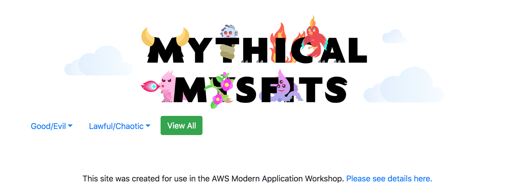

Monolith to Microservices with Docker and AWS EKS
====================================================

Welcome to the Mythical Mysfits team!

In this lab, you'll build the monolithic Mythical Mysfits adoption platform with Docker, deploy it on Amazon ECS, and then break it down into a couple of more manageable microservices. Let's get started!

### Requirements:

* AWS account - if you don't have one, it's easy and free to [create one](https://aws.amazon.com/).
* AWS IAM account with elevated privileges allowing you to interact with CloudFormation, IAM, EC2, ECS, ECR, ELB/ALB, VPC, SNS, CloudWatch, Cloud9. [Learn how](https://docs.aws.amazon.com/IAM/latest/UserGuide/id_users_create.html).
* Familiarity with [Python](https://wiki.python.org/moin/BeginnersGuide/Programmers), [Docker](https://www.docker.com/), and [AWS](httpts://aws.amazon.com) - *not required but a bonus*.

### What you'll do:

These labs are designed to be completed in sequence, and the full set of instructions are documented below.  Read and follow along to complete the labs.  If you're at a live AWS event, the workshop staff will give you a high-level overview of the labs and help answer any questions.  Don't worry if you get stuck, we provide hints along the way.

* **Workshop Setup:** [Setup working environment on AWS](#lets-begin)
* **Lab 1:** [Containerize the Mythical Mysfits monolith](#lab-1---containerize-the-mythical-mysfits-adoption-agency-platform)


### Conventions:

Throughout this workshop, we will provide commands for you to run in the terminal.  These commands will look like this:

<pre>
$ ssh -i <b><i>PRIVATE_KEY.PEM</i></b> ec2-user@<b><i>EC2_PUBLIC_DNS_NAME</i></b>
</pre>

The command starts after the `$`.  Text that is ***UPPER_ITALIC_BOLD*** indicates a value that is unique to your environment.  For example, ***PRIVATE\_KEY.PEM*** refers to the private key of an SSH key pair that you've created in your account, and ***EC2\_PUBLIC\_DNS\_NAME*** is a value that is specific to an EC2 instance launched in your account.  You can find these unique values either in the CloudFormation outputs or by navigating to the specific service dashboard in the [AWS management console](https://console.aws.amazon.com).

Hints are also provided along the way and will look like this:

<details>
<summary>HINT</summary>

**Nice work, you just revealed a hint!**
</details>


*Click on the arrow to show the contents of the hint.*

### IMPORTANT: Workshop Cleanup

You will be deploying infrastructure on AWS which will have an associated cost. If you're attending an AWS event, credits will be provided.  When you're done with the workshop, [follow the steps at the very end of the instructions](#workshop-cleanup) to make sure everything is cleaned up and avoid unnecessary charges.


## Let's Begin!

### Workshop Setup:

2. Setup your Cloud9 environment
    

3. Access the AWS Cloud9 Environment created by CloudFormation:

    On the AWS Console home page, type **Cloud9** into the service search bar and select it. Find the environment named like "Project-***STACK_NAME***":

    

    When you open the IDE, you'll be presented with a welcome screen that looks like this:
    

    On the left pane (Blue), any files downloaded to your environment will appear here in the file tree. In the middle (Red) pane, any documents you open will show up here. Test this out by double clicking on README.md in the left pane and edit the file by adding some arbitrary text. Then save it by clicking File and Save. Keyboard shortcuts will work as well. On the bottom, you will see a bash shell (Yellow). For the remainder of the lab, use this shell to enter all commands. You can also customize your Cloud9 environment by changing themes, moving panes around, etc. (if you like the dark theme, you can select it by clicking the gear icon in the upper right, then "Themes", and choosing the dark theme).

4. Clone the Mythical Mysfits Workshop Repository:

    In the bottom panel of your new Cloud9 IDE, you will see a terminal command line terminal open and ready to use.  Run the following git command in the terminal to clone the necessary code to complete this tutorial:

    ```
    $ git clone https://github.com/ancient87/amazon-ecs-mythicalmysfits-workshop-eks.git
    ```

    After cloning the repository, you'll see that your project explorer now includes the files cloned.

    In the terminal, change directory to the subdirectory for this workshop in the repo:

    ```
    $ cd amazon-ecs-mythicalmysfits-workshop/workshop-1-k8s
    ```

5. Run some additional automated setup steps with the `setup` script:

    ```
    $ script/setup
    ```

    This script will delete some unneeded Docker images to free up disk space, populate a DynamoDB table with some seed data, upload site assets to S3, and install some Docker-related authentication mechanisms that will be discussed later. Make sure you see the "Success!" message when the script completes.

### Checkpoint:
At this point, the Mythical Mysfits website should be available at the static site endpoint for the S3 bucket created by CloudFormation. You can visit the site at <code>http://<b><i>BUCKET_NAME</i></b>.s3-website.<b><i>REGION</i></b>.amazonaws.com/</code>. For your convenience, we've created a link in the CloudFormation outputs tab in the console. Alternatively, you can find the ***BUCKET_NAME*** in the CloudFormation outputs saved in the file `workshop-1/cfn-outputs.json`. ***REGION*** should be the [code](https://docs.aws.amazon.com/general/latest/gr/rande.html#s3_region) for the region that you deployed your CloudFormation stack in (e.g. <i>us-west-2</i> for the Oregon region.) Check that you can view the site, but there won't be much content visible yet until we launch the Mythical Mysfits monolith service:



[*^ back to top*](#monolith-to-microservices-with-docker-and-aws-fargate)


## Lab 1 - Containerize the Mythical Mysfits adoption agency platform

# Create EKS cluster
eksctl create cluster -f eksworkshop.yaml 

eksctl create nodegroup  --cluster eksworkshop-eksctl
aws eks --region ap-southeast-1 update-kubeconfig --name eksworkshop-eksctl

kubectl get nodes

# Create ECR
cd cdk
pip install poetry
poetry install
poetry run cdk deploy -c role_arn=arn:aws:iam::933099113098:role/eksctl-eksworkshop-eksctl-nodegro-NodeInstanceRole-QC9GK6HS7G6J
## Note outputs

export ECR_MONOLITH=933099113098.dkr.ecr.ap-southeast-1.amazonaws.com/ecr-monolit-194a5x35dmcvi
export ECR_LIKE=933099113098.dkr.ecr.ap-southeast-1.amazonaws.com/ecr-like10b-1vz74g3xo3wo3

# Login to ECR
aws ecr get-login-password --region ap-southeast-1 | docker login --username AWS --password-stdin 933099113098.dkr.ecr.ap-southeast-1.amazonaws.com

# Continue with normal instructions to build tag and push


# Fix manifest

# Deploy manifest
kubectl apply -f app/manifests/monolith.yml 
kubectl get pods --namespace mysfits --watch

# Set security group

# Expose
kubectl expose deployment mysfits  --type=NodePort  --name=mysfits-service
kubectl get nodes -o wide |  awk {'print $1" " $2 " " $7'} | column -t